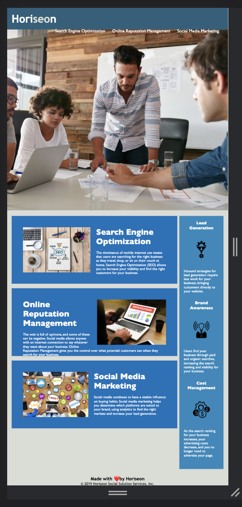

# Fun-Code-Refactor
Learning HTML and CSS
I practiced refactoring and organization of CSS and HTML code by doing the following:
#1 - I fixed the search engine optimization link by adding an Id on the 29th line.
#2 - Added alt tags to all images.
#3 - Condensed the search engine optimization, online reputation management, and social media marketing classes into one single class titled "center".
#4 - Consolidated lead generation, brand awareness, and cost management classes into a single class titled "icons"

[Deployed Application](https://blakelikestoast.github.io/Fun-Code-Refactor/)
